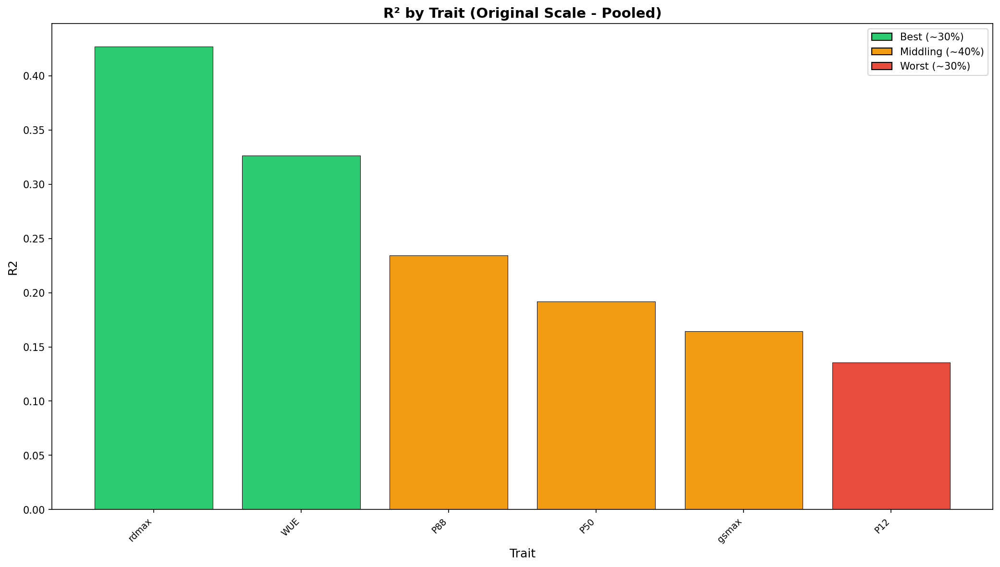
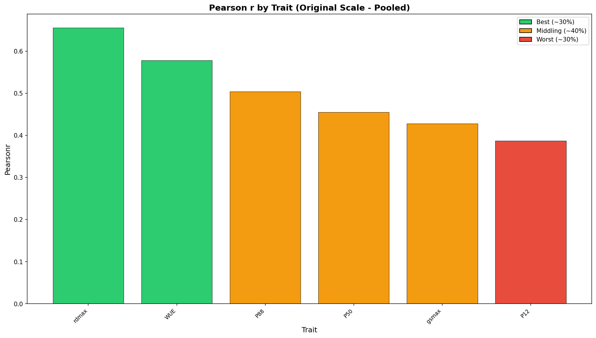
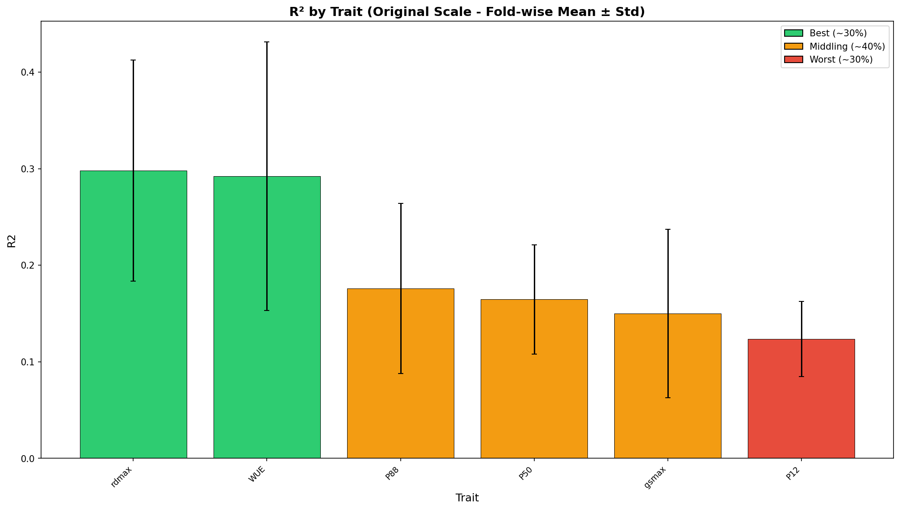

# Cross-Validation Performance Report

**Product:** hyd_cwm_stg_no-xf_1km  
**Run ID:** run_20260120_142303  
**Trait Set:** splot_gbif  
**Number of Traits:** 6  

---

## Performance Summary

Traits are categorized based on Pearson's r (original scale):

### Best Performing Traits (~30%)

- rdmax

### Middling Performance (~40%)

- WUE
- P88
- P50

### Worst Performing Traits (~30%)

- gsmax
- P12

---

## Detailed Metrics

### Original Scale - Pooled Statistics

*Statistics computed from all CV predictions pooled together.*

| Trait | R² | Pearson r | RMSE | nRMSE |
|-------|-----|-----------|------|-------|
| rdmax | 0.427 | 0.656 | 1.848 | 0.154 |
| WUE | 0.326 | 0.578 | 4.560 | 0.157 |
| P88 | 0.235 | 0.504 | 1.120 | 0.156 |
| P50 | 0.192 | 0.455 | 0.989 | 0.171 |
| gsmax | 0.164 | 0.428 | 49.352 | 0.165 |
| P12 | 0.135 | 0.387 | 0.682 | 0.168 |

### Original Scale - Fold-wise Statistics

*Mean ± standard deviation across CV folds.*

| Trait | R² (mean ± std) | Pearson r (mean ± std) | RMSE (mean ± std) |
|-------|-----------------|------------------------|-------------------|
| rdmax | 0.298 ± 0.115 | 0.557 ± 0.094 | 1.864 ± 0.957 |
| WUE | 0.292 ± 0.139 | 0.545 ± 0.128 | 4.601 ± 0.464 |
| P88 | 0.176 ± 0.088 | 0.460 ± 0.070 | 1.108 ± 0.215 |
| P50 | 0.165 ± 0.056 | 0.425 ± 0.065 | 1.022 ± 0.196 |
| gsmax | 0.150 ± 0.087 | 0.414 ± 0.090 | 50.557 ± 7.115 |
| P12 | 0.124 ± 0.039 | 0.370 ± 0.058 | 0.689 ± 0.071 |

---

## Charts

### Original Scale - Pooled

*Statistics computed from all CV predictions pooled together.*

#### R² by Trait

#### Pearson r by Trait

### Original Scale - Fold-wise

*Mean ± standard deviation across CV folds.*

#### R² by Trait

#### Pearson r by Trait

---

## Download Charts (PDF)

- [R² Original Pooled](figures/r2_by_trait_original_pooled.pdf) | [Pearson r Original Pooled](figures/pearsonr_by_trait_original_pooled.pdf)
- [R² Original Fold-wise](figures/r2_by_trait_original_foldwise.pdf) | [Pearson r Original Fold-wise](figures/pearsonr_by_trait_original_foldwise.pdf)
