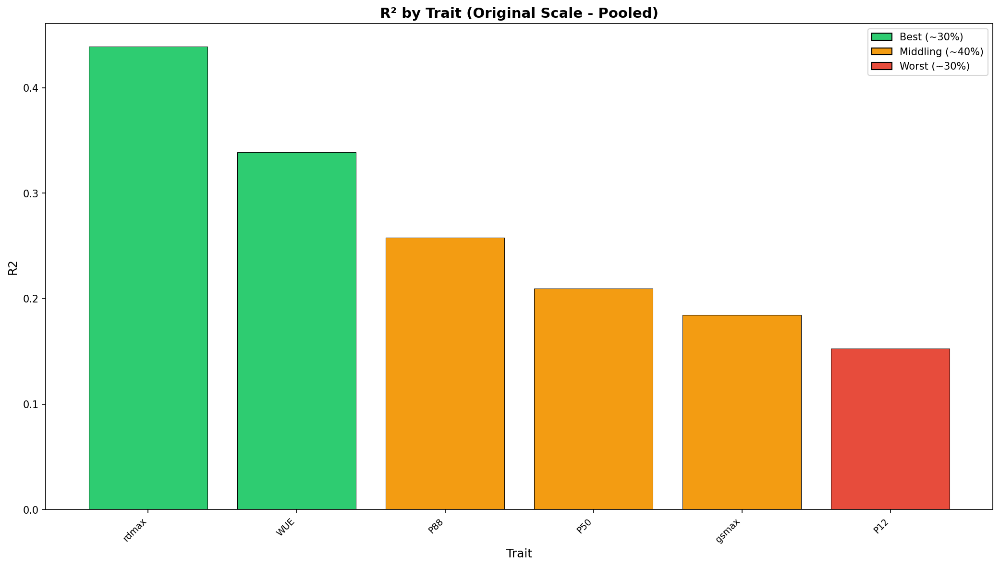
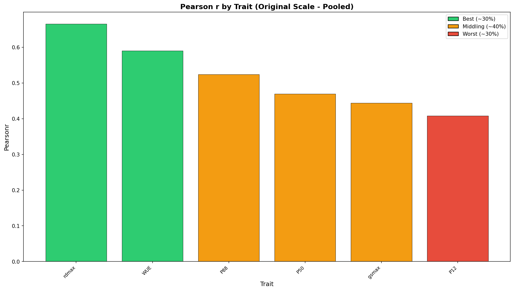
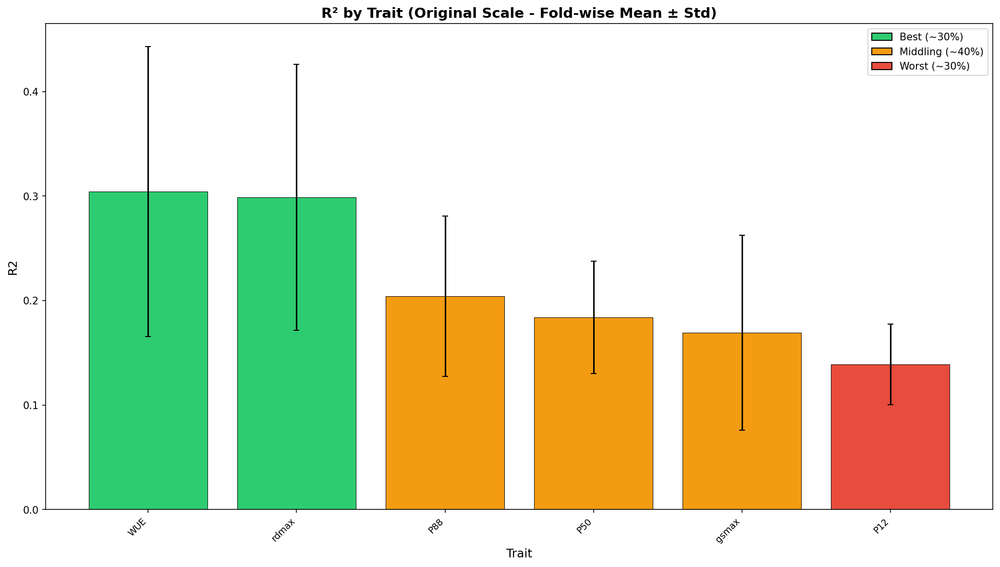
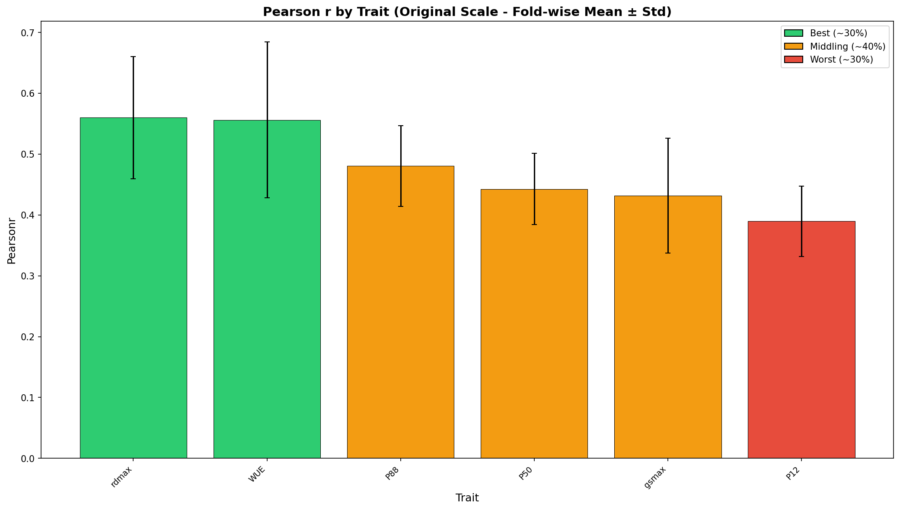

# Cross-Validation Performance Report

**Product:** hyd_cwm_stg_no-xf_1km  
**Run ID:** run_20260121_084736  
**Trait Set:** splot_gbif  
**Number of Traits:** 6  

---

## Performance Summary

Traits are categorized based on Pearson's r (original scale):

### Best Performing Traits (~30%)

- rdmax

### Middling Performance (~40%)

- WUE
- P88
- P50

### Worst Performing Traits (~30%)

- gsmax
- P12

---

## Detailed Metrics

### Original Scale - Pooled Statistics

*Statistics computed from all CV predictions pooled together.*

| Trait | R² | Pearson r | RMSE | nRMSE |
|-------|-----|-----------|------|-------|
| rdmax | 0.439 | 0.665 | 1.828 | 0.152 |
| WUE | 0.339 | 0.590 | 4.517 | 0.156 |
| P88 | 0.258 | 0.524 | 1.103 | 0.154 |
| P50 | 0.210 | 0.469 | 0.978 | 0.169 |
| gsmax | 0.184 | 0.444 | 48.759 | 0.163 |
| P12 | 0.153 | 0.408 | 0.675 | 0.167 |

### Original Scale - Fold-wise Statistics

*Mean ± standard deviation across CV folds.*

| Trait | R² (mean ± std) | Pearson r (mean ± std) | RMSE (mean ± std) |
|-------|-----------------|------------------------|-------------------|
| rdmax | 0.299 ± 0.127 | 0.560 ± 0.101 | 1.852 ± 0.932 |
| WUE | 0.304 ± 0.139 | 0.556 ± 0.128 | 4.560 ± 0.456 |
| P88 | 0.204 ± 0.077 | 0.481 ± 0.066 | 1.090 ± 0.218 |
| P50 | 0.184 ± 0.054 | 0.443 ± 0.059 | 1.010 ± 0.193 |
| gsmax | 0.169 ± 0.093 | 0.432 ± 0.094 | 49.994 ± 7.330 |
| P12 | 0.139 ± 0.039 | 0.390 ± 0.058 | 0.683 ± 0.072 |

---

## Charts

### Original Scale - Pooled

*Statistics computed from all CV predictions pooled together.*

#### R² by Trait

#### Pearson r by Trait

### Original Scale - Fold-wise

*Mean ± standard deviation across CV folds.*

#### R² by Trait

#### Pearson r by Trait

---

## Download Charts (PDF)

- [R² Original Pooled](figures/r2_by_trait_original_pooled.pdf) | [Pearson r Original Pooled](figures/pearsonr_by_trait_original_pooled.pdf)
- [R² Original Fold-wise](figures/r2_by_trait_original_foldwise.pdf) | [Pearson r Original Fold-wise](figures/pearsonr_by_trait_original_foldwise.pdf)
