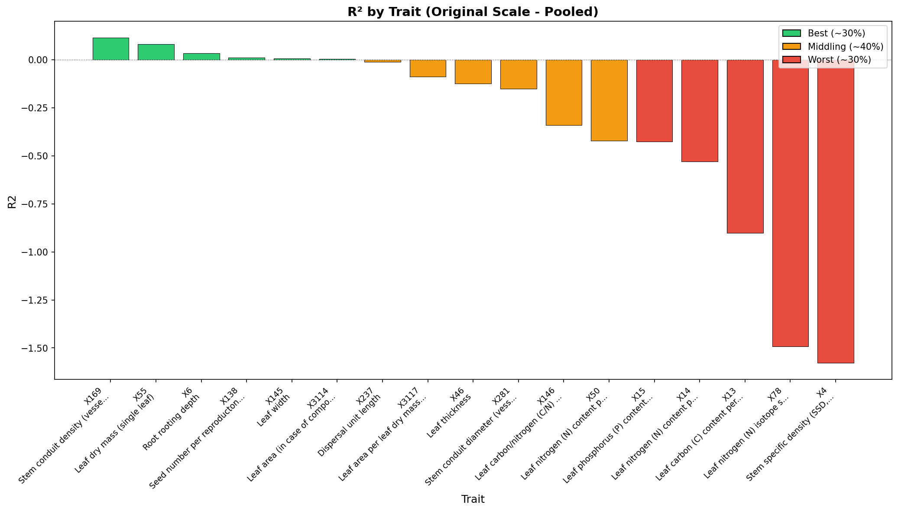
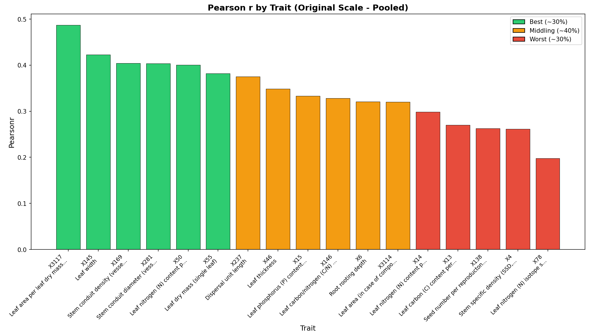
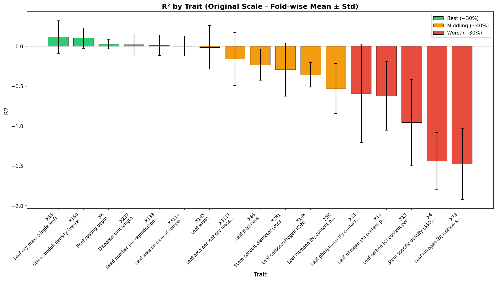
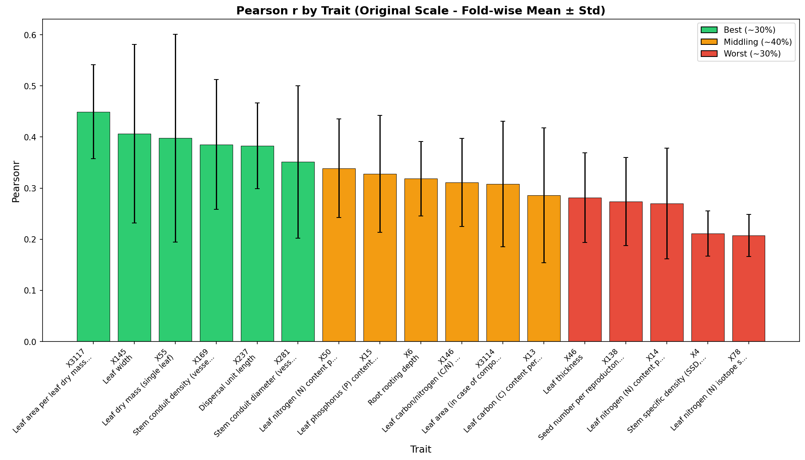

# Cross-Validation Performance Report

**Product:** try6_q05_stg_no-xf_1km  
**Run ID:** run_20260115_102931  
**Trait Set:** splot_gbif  
**Number of Traits:** 17  

---

## Performance Summary

Traits are categorized based on Pearson's r (original scale):

### Best Performing Traits (~30%)

- X3117 (Leaf area per leaf dry mass (specific leaf area, SLA or 1/LMA): undefined if petiole is in- or exclu)
- X145 (Leaf width)
- X55 (Leaf dry mass (single leaf))
- X169 (Stem conduit density (vessels and tracheids))
- X237 (Dispersal unit length)

### Middling Performance (~40%)

- X281 (Stem conduit diameter (vessels, tracheids))
- X50 (Leaf nitrogen (N) content per leaf area)
- X15 (Leaf phosphorus (P) content per leaf dry mass)
- X6 (Root rooting depth)
- X146 (Leaf carbon/nitrogen (C/N) ratio)
- X3114 (Leaf area (in case of compound leaves undefined if leaf or leaflet, undefined if petiole is in- or e)

### Worst Performing Traits (~30%)

- X13 (Leaf carbon (C) content per leaf dry mass)
- X46 (Leaf thickness)
- X138 (Seed number per reproducton unit)
- X14 (Leaf nitrogen (N) content per leaf dry mass)
- X4 (Stem specific density (SSD, stem dry mass per stem fresh volume) or wood density)
- X78 (Leaf nitrogen (N) isotope signature (delta 15N))

---

## Detailed Metrics

### Original Scale - Pooled Statistics

*Statistics computed from all CV predictions pooled together.*

| Trait | R² | Pearson r | RMSE | nRMSE |
|-------|-----|-----------|------|-------|
| X3117 | -0.089 | 0.487 | 10.321 | 0.247 |
| X145 | 0.007 | 0.423 | 3.435 | 0.268 |
| X169 | 0.115 | 0.404 | 526.512 | 0.235 |
| X281 | -0.152 | 0.403 | 48.736 | 0.290 |
| X50 | -0.422 | 0.400 | 0.668 | 0.273 |
| X55 | 0.080 | 0.382 | 270.909 | 0.202 |
| X237 | -0.012 | 0.375 | 6.510 | 0.277 |
| X46 | -0.126 | 0.349 | 0.149 | 0.295 |
| X15 | -0.426 | 0.333 | 0.808 | 0.272 |
| X146 | -0.341 | 0.328 | 10.062 | 0.257 |
| X6 | 0.033 | 0.321 | 1.607 | 0.231 |
| X3114 | 0.004 | 0.320 | 3250.821 | 0.181 |
| X14 | -0.530 | 0.298 | 7.814 | 0.274 |
| X13 | -0.903 | 0.270 | 31.114 | 0.304 |
| X138 | 0.011 | 0.263 | 14265.472 | 0.239 |
| X4 | -1.579 | 0.262 | 0.204 | 0.348 |
| X78 | -1.493 | 0.198 | 2.846 | 0.318 |

### Original Scale - Fold-wise Statistics

*Mean ± standard deviation across CV folds.*

| Trait | R² (mean ± std) | Pearson r (mean ± std) | RMSE (mean ± std) |
|-------|-----------------|------------------------|-------------------|
| X3117 | -0.162 ± 0.331 | 0.449 ± 0.092 | 10.244 ± 0.701 |
| X145 | -0.013 ± 0.273 | 0.406 ± 0.175 | 3.379 ± 0.423 |
| X55 | 0.117 ± 0.205 | 0.398 ± 0.203 | 274.803 ± 11.744 |
| X169 | 0.101 ± 0.129 | 0.385 ± 0.127 | 546.537 ± 95.421 |
| X237 | 0.022 ± 0.132 | 0.383 ± 0.084 | 6.188 ± 0.692 |
| X281 | -0.291 ± 0.335 | 0.351 ± 0.149 | 48.649 ± 5.237 |
| X50 | -0.531 ± 0.314 | 0.339 ± 0.097 | 0.673 ± 0.051 |
| X15 | -0.595 ± 0.614 | 0.328 ± 0.114 | 0.843 ± 0.158 |
| X6 | 0.028 ± 0.059 | 0.318 ± 0.073 | 1.605 ± 0.114 |
| X146 | -0.359 ± 0.155 | 0.311 ± 0.086 | 10.133 ± 0.823 |
| X3114 | 0.003 ± 0.125 | 0.308 ± 0.123 | 3272.317 ± 717.670 |
| X13 | -0.956 ± 0.542 | 0.286 ± 0.132 | 31.742 ± 3.775 |
| X46 | -0.231 ± 0.196 | 0.281 ± 0.088 | 0.150 ± 0.015 |
| X138 | 0.013 ± 0.128 | 0.274 ± 0.086 | 13610.275 ± 1858.455 |
| X14 | -0.624 ± 0.430 | 0.270 ± 0.109 | 7.740 ± 0.686 |
| X4 | -1.437 ± 0.357 | 0.211 ± 0.044 | 0.190 ± 0.024 |
| X78 | -1.476 ± 0.448 | 0.207 ± 0.041 | 2.833 ± 0.294 |

---

## Charts

### Original Scale - Pooled

*Statistics computed from all CV predictions pooled together.*

#### R² by Trait

#### Pearson r by Trait

### Original Scale - Fold-wise

*Mean ± standard deviation across CV folds.*

#### R² by Trait

#### Pearson r by Trait

---

## Download Charts (PDF)

- [R² Original Pooled](figures/r2_by_trait_original_pooled.pdf) | [Pearson r Original Pooled](figures/pearsonr_by_trait_original_pooled.pdf)
- [R² Original Fold-wise](figures/r2_by_trait_original_foldwise.pdf) | [Pearson r Original Fold-wise](figures/pearsonr_by_trait_original_foldwise.pdf)
