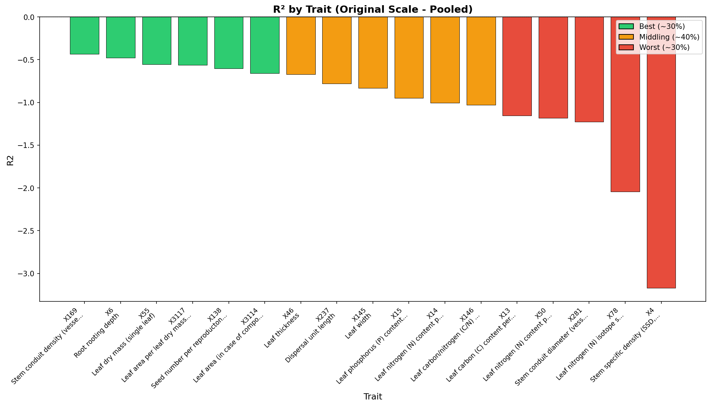
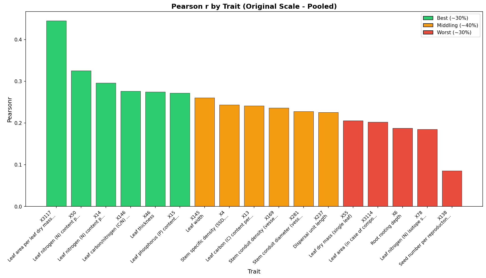
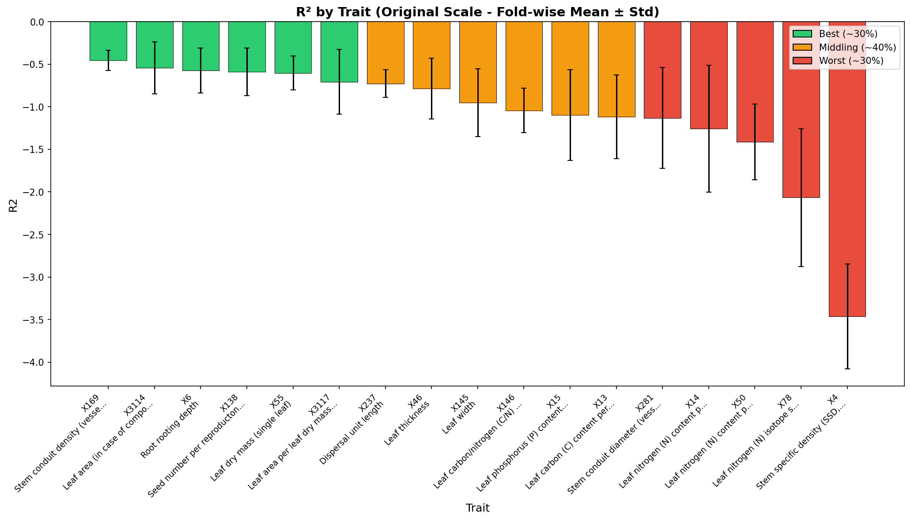
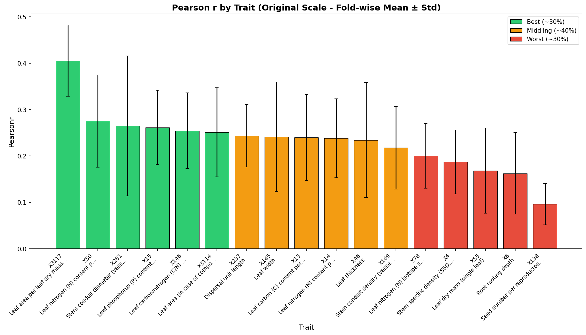
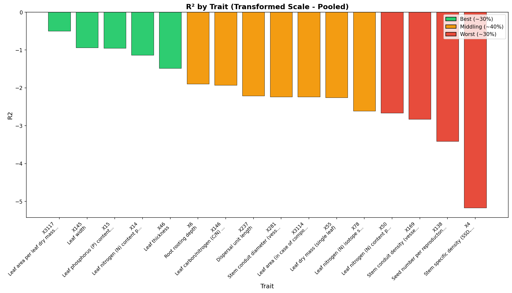
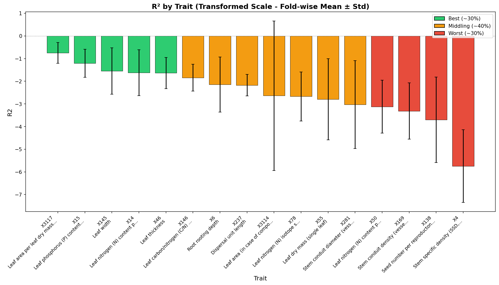
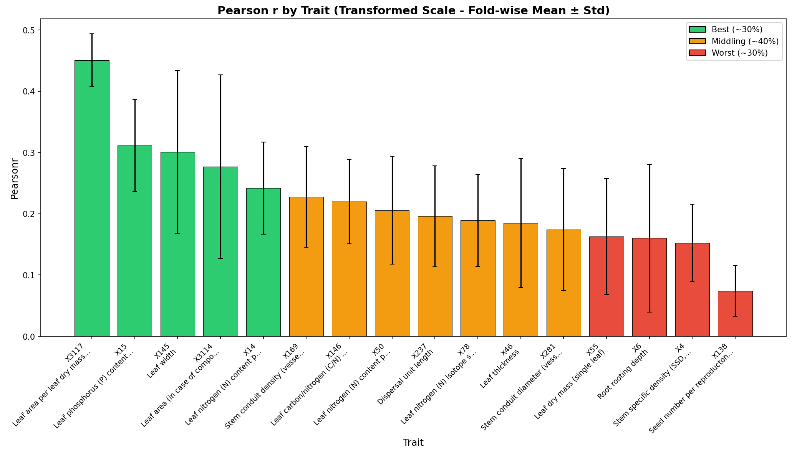

# Cross-Validation Performance Report

**Product:** try6_q05_stg_pow-xf_1km  
**Run ID:** run_20260115_142836  
**Trait Set:** splot_gbif  
**Number of Traits:** 17  

---

## Performance Summary

Traits are categorized based on Pearson's r (original scale):

### Best Performing Traits (~30%)

- X3117 (Leaf area per leaf dry mass (specific leaf area, SLA or 1/LMA): undefined if petiole is in- or exclu)
- X50 (Leaf nitrogen (N) content per leaf area)
- X281 (Stem conduit diameter (vessels, tracheids))
- X15 (Leaf phosphorus (P) content per leaf dry mass)
- X146 (Leaf carbon/nitrogen (C/N) ratio)

### Middling Performance (~40%)

- X3114 (Leaf area (in case of compound leaves undefined if leaf or leaflet, undefined if petiole is in- or e)
- X237 (Dispersal unit length)
- X145 (Leaf width)
- X13 (Leaf carbon (C) content per leaf dry mass)
- X14 (Leaf nitrogen (N) content per leaf dry mass)
- X46 (Leaf thickness)

### Worst Performing Traits (~30%)

- X169 (Stem conduit density (vessels and tracheids))
- X78 (Leaf nitrogen (N) isotope signature (delta 15N))
- X4 (Stem specific density (SSD, stem dry mass per stem fresh volume) or wood density)
- X55 (Leaf dry mass (single leaf))
- X6 (Root rooting depth)
- X138 (Seed number per reproducton unit)

---

## Detailed Metrics

### Original Scale - Pooled Statistics

*Statistics computed from all CV predictions pooled together.*

| Trait | R² | Pearson r | RMSE | nRMSE |
|-------|-----|-----------|------|-------|
| X3117 | -0.562 | 0.445 | 12.362 | 0.296 |
| X50 | -1.183 | 0.325 | 0.827 | 0.338 |
| X14 | -1.008 | 0.296 | 8.951 | 0.314 |
| X146 | -1.031 | 0.276 | 12.380 | 0.316 |
| X46 | -0.670 | 0.274 | 0.181 | 0.360 |
| X15 | -0.949 | 0.272 | 0.945 | 0.318 |
| X145 | -0.833 | 0.260 | 4.666 | 0.364 |
| X4 | -3.168 | 0.243 | 0.260 | 0.443 |
| X13 | -1.156 | 0.241 | 33.117 | 0.323 |
| X169 | -0.434 | 0.236 | 670.357 | 0.299 |
| X281 | -1.228 | 0.228 | 67.766 | 0.403 |
| X237 | -0.780 | 0.225 | 8.634 | 0.367 |
| X55 | -0.555 | 0.205 | 352.083 | 0.263 |
| X3114 | -0.659 | 0.202 | 4196.004 | 0.234 |
| X6 | -0.480 | 0.188 | 1.987 | 0.285 |
| X78 | -2.042 | 0.184 | 3.144 | 0.351 |
| X138 | -0.604 | 0.086 | 18172.758 | 0.305 |

### Original Scale - Fold-wise Statistics

*Mean ± standard deviation across CV folds.*

| Trait | R² (mean ± std) | Pearson r (mean ± std) | RMSE (mean ± std) |
|-------|-----------------|------------------------|-------------------|
| X3117 | -0.708 ± 0.379 | 0.405 ± 0.077 | 12.297 ± 1.277 |
| X50 | -1.414 ± 0.445 | 0.275 ± 0.100 | 0.832 ± 0.031 |
| X281 | -1.132 ± 0.593 | 0.265 ± 0.151 | 63.858 ± 8.874 |
| X15 | -1.098 ± 0.535 | 0.261 ± 0.080 | 0.962 ± 0.138 |
| X146 | -1.044 ± 0.261 | 0.254 ± 0.082 | 12.568 ± 1.110 |
| X3114 | -0.543 ± 0.305 | 0.251 ± 0.096 | 3854.581 ± 678.594 |
| X237 | -0.728 ± 0.164 | 0.244 ± 0.067 | 8.421 ± 0.559 |
| X145 | -0.952 ± 0.399 | 0.241 ± 0.118 | 4.693 ± 0.535 |
| X13 | -1.116 ± 0.492 | 0.240 ± 0.093 | 32.974 ± 2.410 |
| X14 | -1.258 ± 0.746 | 0.238 ± 0.085 | 8.846 ± 1.113 |
| X46 | -0.786 ± 0.356 | 0.234 ± 0.124 | 0.182 ± 0.012 |
| X169 | -0.454 ± 0.118 | 0.218 ± 0.089 | 684.410 ± 69.116 |
| X78 | -2.067 ± 0.808 | 0.200 ± 0.070 | 3.120 ± 0.291 |
| X4 | -3.462 ± 0.614 | 0.187 ± 0.069 | 0.265 ± 0.019 |
| X55 | -0.605 ± 0.200 | 0.169 ± 0.092 | 361.791 ± 62.928 |
| X6 | -0.573 ± 0.263 | 0.162 ± 0.088 | 1.987 ± 0.089 |
| X138 | -0.591 ± 0.279 | 0.096 ± 0.045 | 17700.491 ± 2986.006 |

### Transformed Scale - Pooled Statistics

*Statistics computed from all CV predictions pooled together (in transformed space).*

| Trait | R² | Pearson r | RMSE | nRMSE |
|-------|-----|-----------|------|-------|
| X3117 | -0.496 | 0.490 | 0.297 | 0.248 |
| X145 | -0.939 | 0.362 | 0.277 | 0.316 |
| X15 | -0.952 | 0.336 | 0.131 | 0.279 |
| X14 | -1.138 | 0.311 | 0.083 | 0.289 |
| X50 | -2.662 | 0.252 | 0.076 | 0.426 |
| X169 | -2.824 | 0.250 | 0.337 | 0.380 |
| X3114 | -2.239 | 0.241 | 0.642 | 0.362 |
| X146 | -1.931 | 0.233 | 0.034 | 0.353 |
| X4 | -5.165 | 0.209 | 0.042 | 0.496 |
| X46 | -1.481 | 0.208 | 0.023 | 0.398 |
| X281 | -2.233 | 0.207 | 0.040 | 0.420 |
| X6 | -1.898 | 0.191 | 0.160 | 0.398 |
| X237 | -2.208 | 0.186 | 0.282 | 0.432 |
| X55 | -2.254 | 0.181 | 0.821 | 0.384 |
| X78 | -2.608 | 0.175 | 2.883 | 0.370 |
| X138 | -3.408 | 0.087 | 1.308 | 0.467 |

### Transformed Scale - Fold-wise Statistics

*Mean ± standard deviation across CV folds (in transformed space).*

| Trait | R² (mean ± std) | Pearson r (mean ± std) | RMSE (mean ± std) |
|-------|-----------------|------------------------|-------------------|
| X3117 | -0.747 ± 0.459 | 0.451 ± 0.043 | 0.300 ± 0.043 |
| X15 | -1.209 ± 0.616 | 0.311 ± 0.075 | 0.136 ± 0.015 |
| X145 | -1.547 ± 1.024 | 0.301 ± 0.133 | 0.280 ± 0.036 |
| X3114 | -2.639 ± 3.302 | 0.277 ± 0.150 | 0.614 ± 0.103 |
| X14 | -1.627 ± 1.015 | 0.242 ± 0.075 | 0.084 ± 0.009 |
| X169 | -3.314 ± 1.246 | 0.227 ± 0.082 | 0.348 ± 0.045 |
| X146 | -1.846 ± 0.591 | 0.220 ± 0.069 | 0.033 ± 0.003 |
| X50 | -3.122 ± 1.171 | 0.206 ± 0.088 | 0.078 ± 0.009 |
| X237 | -2.175 ± 0.474 | 0.196 ± 0.082 | 0.282 ± 0.011 |
| X78 | -2.673 ± 1.086 | 0.189 ± 0.075 | 2.867 ± 0.289 |
| X46 | -1.636 ± 0.688 | 0.185 ± 0.105 | 0.023 ± 0.002 |
| X281 | -3.033 ± 1.940 | 0.174 ± 0.100 | 0.041 ± 0.004 |
| X55 | -2.799 ± 1.791 | 0.163 ± 0.095 | 0.853 ± 0.168 |
| X6 | -2.148 ± 1.216 | 0.160 ± 0.121 | 0.165 ± 0.032 |
| X4 | -5.745 ± 1.607 | 0.153 ± 0.063 | 0.042 ± 0.006 |
| X138 | -3.704 ± 1.883 | 0.074 ± 0.042 | 1.322 ± 0.177 |

---

## Charts

### Original Scale - Pooled

*Statistics computed from all CV predictions pooled together.*

#### R² by Trait

#### Pearson r by Trait

### Original Scale - Fold-wise

*Mean ± standard deviation across CV folds.*

#### R² by Trait

#### Pearson r by Trait

### Transformed Scale - Pooled

*Statistics computed from all CV predictions pooled together (in transformed space).*

#### R² by Trait

#### Pearson r by Trait

### Transformed Scale - Fold-wise

*Mean ± standard deviation across CV folds (in transformed space).*

#### R² by Trait

#### Pearson r by Trait

---

## Download Charts (PDF)

- [R² Original Pooled](figures/r2_by_trait_original_pooled.pdf) | [Pearson r Original Pooled](figures/pearsonr_by_trait_original_pooled.pdf)
- [R² Original Fold-wise](figures/r2_by_trait_original_foldwise.pdf) | [Pearson r Original Fold-wise](figures/pearsonr_by_trait_original_foldwise.pdf)
- [R² Transformed Pooled](figures/r2_by_trait_transformed_pooled.pdf) | [Pearson r Transformed Pooled](figures/pearsonr_by_trait_transformed_pooled.pdf)
- [R² Transformed Fold-wise](figures/r2_by_trait_transformed_foldwise.pdf) | [Pearson r Transformed Fold-wise](figures/pearsonr_by_trait_transformed_foldwise.pdf)
