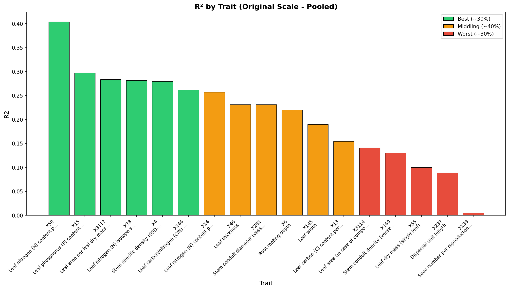
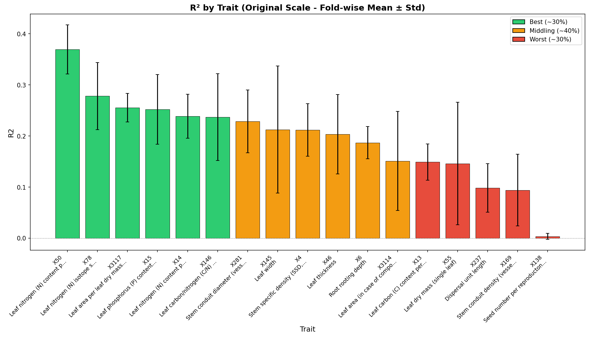
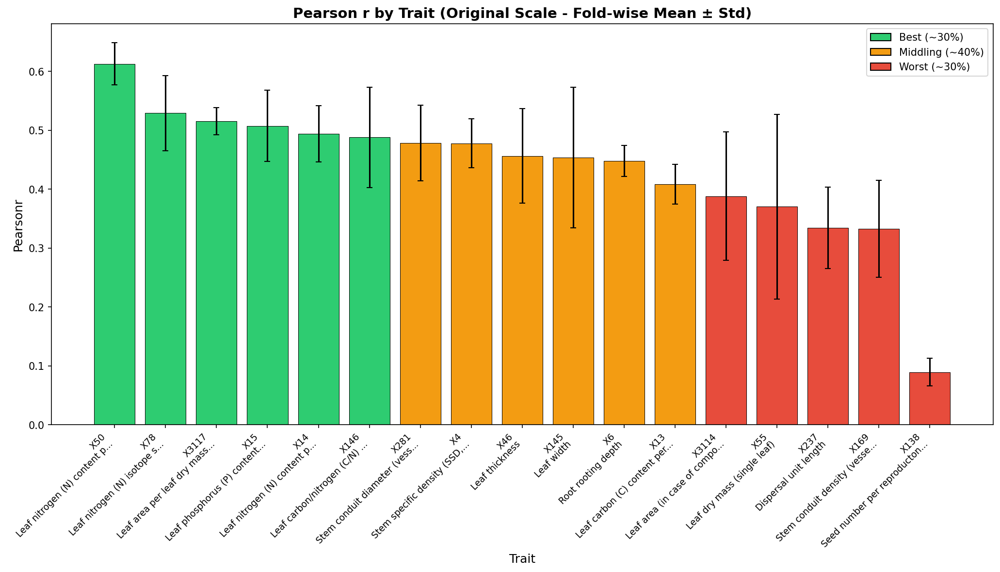

# Cross-Validation Performance Report

**Product:** try6_q25_stg_no-xf_1km  
**Run ID:** run_20260119_095932  
**Trait Set:** splot_gbif  
**Number of Traits:** 17  

---

## Performance Summary

Traits are categorized based on Pearson's r (original scale):

### Best Performing Traits (~30%)

- X50 (Leaf nitrogen (N) content per leaf area)
- X78 (Leaf nitrogen (N) isotope signature (delta 15N))
- X3117 (Leaf area per leaf dry mass (specific leaf area, SLA or 1/LMA): undefined if petiole is in- or exclu)
- X15 (Leaf phosphorus (P) content per leaf dry mass)
- X14 (Leaf nitrogen (N) content per leaf dry mass)

### Middling Performance (~40%)

- X146 (Leaf carbon/nitrogen (C/N) ratio)
- X281 (Stem conduit diameter (vessels, tracheids))
- X4 (Stem specific density (SSD, stem dry mass per stem fresh volume) or wood density)
- X46 (Leaf thickness)
- X145 (Leaf width)
- X6 (Root rooting depth)

### Worst Performing Traits (~30%)

- X13 (Leaf carbon (C) content per leaf dry mass)
- X3114 (Leaf area (in case of compound leaves undefined if leaf or leaflet, undefined if petiole is in- or e)
- X55 (Leaf dry mass (single leaf))
- X237 (Dispersal unit length)
- X169 (Stem conduit density (vessels and tracheids))
- X138 (Seed number per reproducton unit)

---

## Detailed Metrics

### Original Scale - Pooled Statistics

*Statistics computed from all CV predictions pooled together.*

| Trait | R² | Pearson r | RMSE | nRMSE |
|-------|-----|-----------|------|-------|
| X50 | 0.404 | 0.638 | 0.347 | 0.146 |
| X15 | 0.297 | 0.547 | 0.381 | 0.166 |
| X3117 | 0.284 | 0.539 | 5.043 | 0.189 |
| X4 | 0.279 | 0.531 | 0.112 | 0.179 |
| X78 | 0.282 | 0.531 | 1.687 | 0.165 |
| X146 | 0.262 | 0.513 | 4.842 | 0.160 |
| X14 | 0.257 | 0.508 | 3.954 | 0.183 |
| X46 | 0.232 | 0.489 | 0.065 | 0.159 |
| X281 | 0.231 | 0.483 | 15.791 | 0.169 |
| X6 | 0.220 | 0.475 | 0.462 | 0.171 |
| X145 | 0.190 | 0.438 | 1.116 | 0.212 |
| X13 | 0.155 | 0.412 | 17.869 | 0.179 |
| X3114 | 0.141 | 0.381 | 855.879 | 0.229 |
| X169 | 0.130 | 0.372 | 139.502 | 0.218 |
| X55 | 0.100 | 0.327 | 76.156 | 0.229 |
| X237 | 0.089 | 0.319 | 2.206 | 0.181 |
| X138 | 0.005 | 0.090 | 2766.853 | 0.295 |

### Original Scale - Fold-wise Statistics

*Mean ± standard deviation across CV folds.*

| Trait | R² (mean ± std) | Pearson r (mean ± std) | RMSE (mean ± std) |
|-------|-----------------|------------------------|-------------------|
| X50 | 0.370 ± 0.048 | 0.613 ± 0.036 | 0.337 ± 0.052 |
| X78 | 0.278 ± 0.066 | 0.529 ± 0.064 | 1.671 ± 0.118 |
| X3117 | 0.256 ± 0.028 | 0.515 ± 0.023 | 5.018 ± 0.362 |
| X15 | 0.252 ± 0.068 | 0.507 ± 0.060 | 0.380 ± 0.013 |
| X14 | 0.239 ± 0.043 | 0.494 ± 0.048 | 3.891 ± 0.211 |
| X146 | 0.237 ± 0.085 | 0.488 ± 0.085 | 4.866 ± 0.469 |
| X281 | 0.229 ± 0.061 | 0.478 ± 0.064 | 15.911 ± 1.769 |
| X4 | 0.212 ± 0.051 | 0.478 ± 0.041 | 0.114 ± 0.011 |
| X46 | 0.204 ± 0.078 | 0.456 ± 0.080 | 0.066 ± 0.020 |
| X145 | 0.213 ± 0.124 | 0.454 ± 0.119 | 1.082 ± 0.106 |
| X6 | 0.187 ± 0.032 | 0.448 ± 0.026 | 0.495 ± 0.106 |
| X13 | 0.149 ± 0.036 | 0.408 ± 0.034 | 17.903 ± 1.960 |
| X3114 | 0.151 ± 0.097 | 0.388 ± 0.109 | 830.192 ± 169.272 |
| X55 | 0.146 ± 0.120 | 0.370 ± 0.157 | 73.003 ± 9.580 |
| X237 | 0.098 ± 0.047 | 0.334 ± 0.069 | 2.170 ± 0.335 |
| X169 | 0.094 ± 0.070 | 0.333 ± 0.083 | 138.495 ± 25.541 |
| X138 | 0.003 ± 0.006 | 0.089 ± 0.023 | 2709.803 ± 293.813 |

---

## Charts

### Original Scale - Pooled

*Statistics computed from all CV predictions pooled together.*

#### R² by Trait

#### Pearson r by Trait

### Original Scale - Fold-wise

*Mean ± standard deviation across CV folds.*

#### R² by Trait

#### Pearson r by Trait

---

## Download Charts (PDF)

- [R² Original Pooled](figures/r2_by_trait_original_pooled.pdf) | [Pearson r Original Pooled](figures/pearsonr_by_trait_original_pooled.pdf)
- [R² Original Fold-wise](figures/r2_by_trait_original_foldwise.pdf) | [Pearson r Original Fold-wise](figures/pearsonr_by_trait_original_foldwise.pdf)
