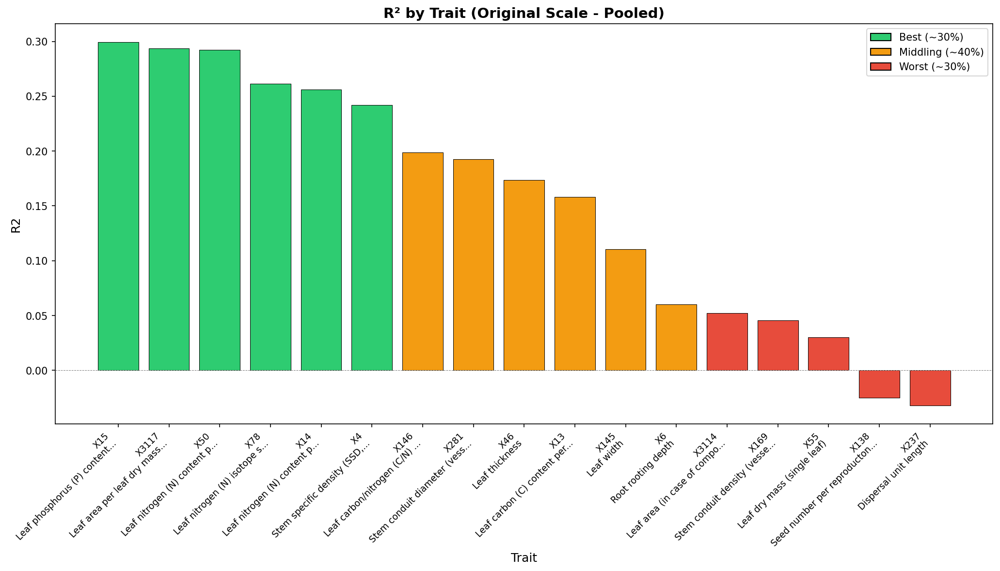
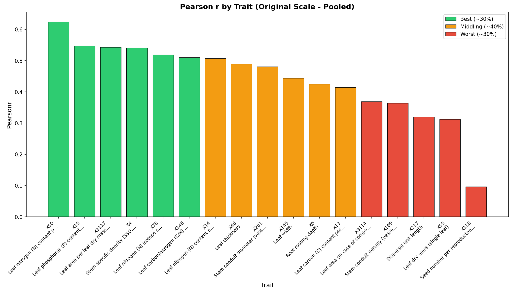
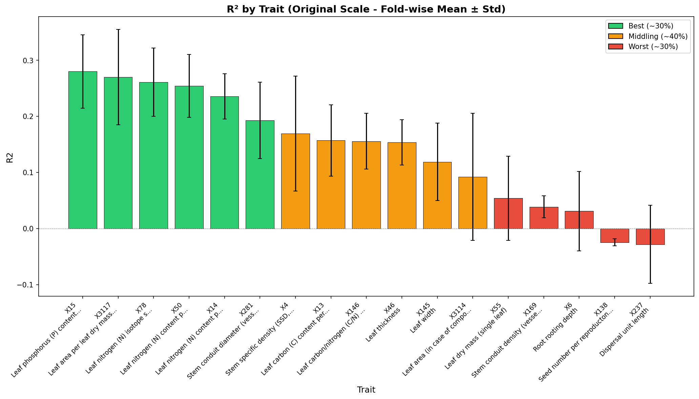
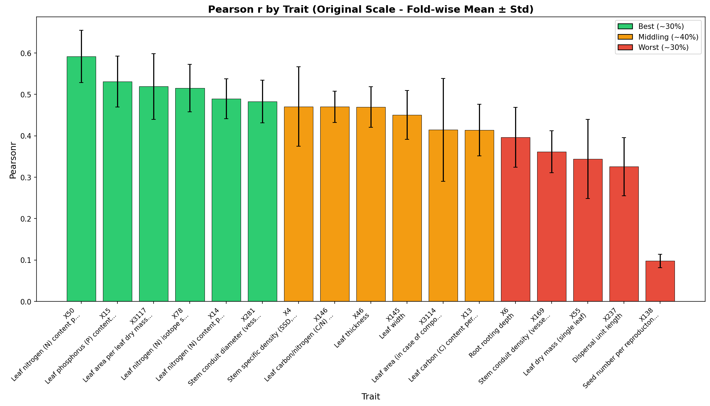
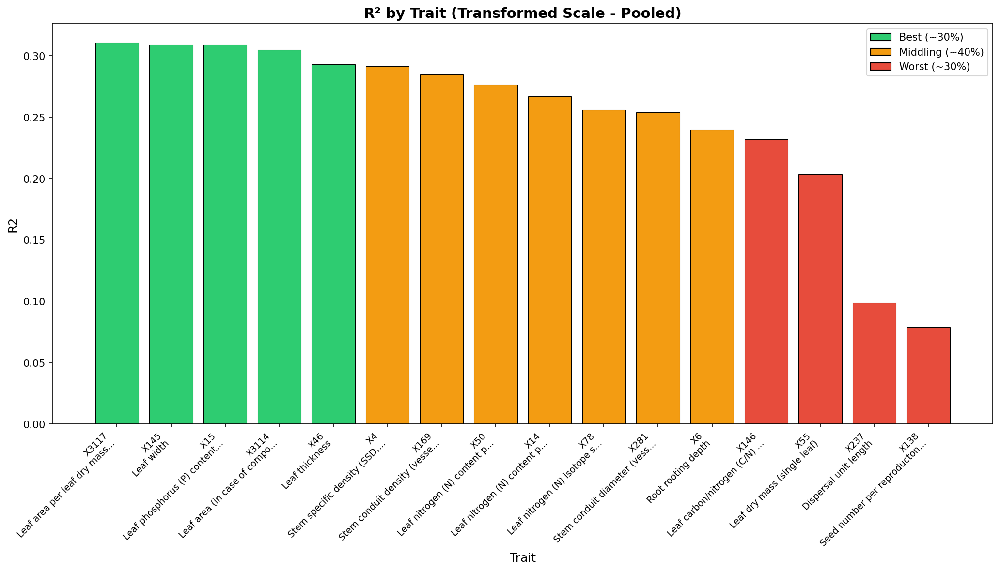
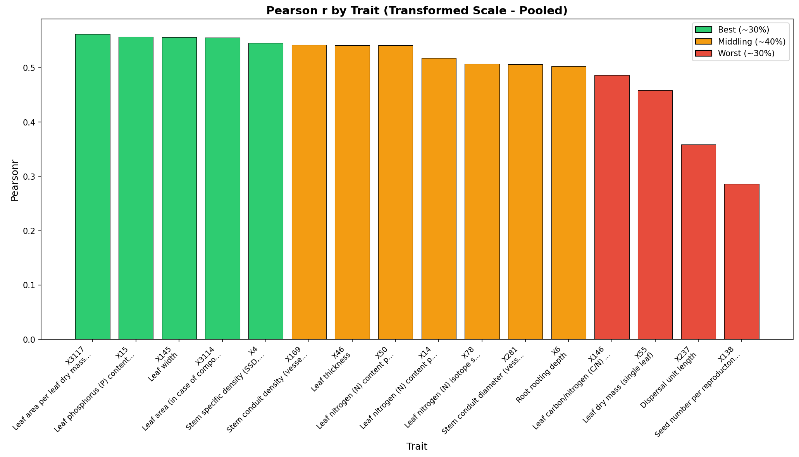
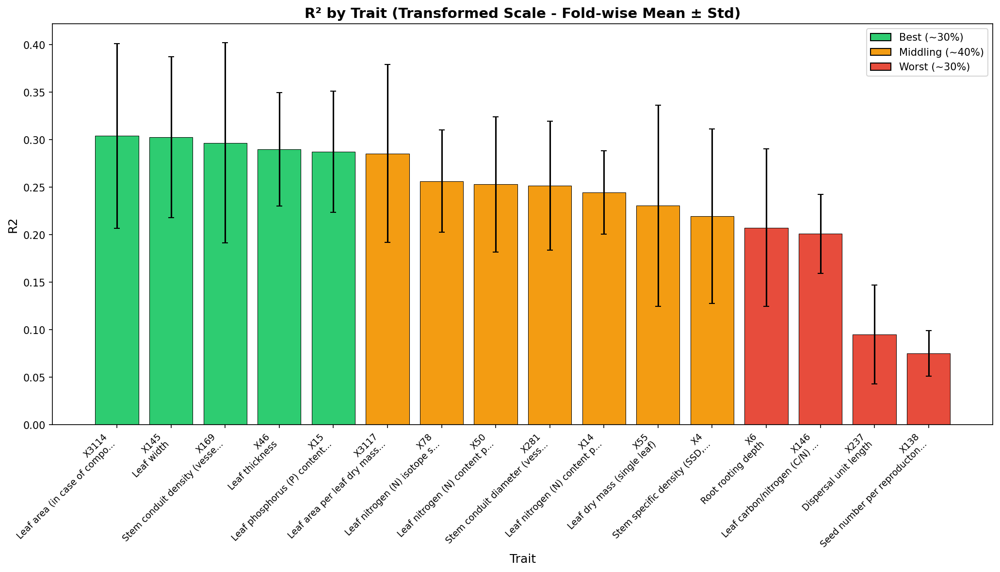
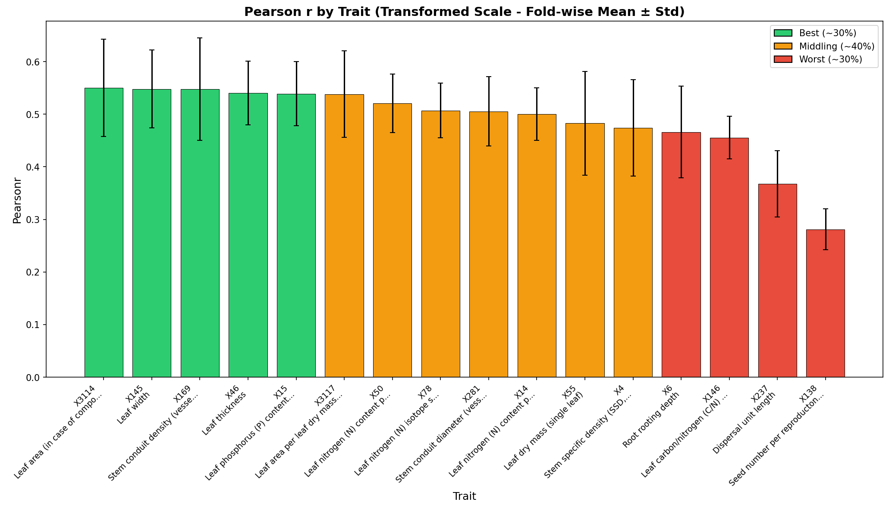

# Cross-Validation Performance Report

**Product:** try6_q25_stg_pow-xf_1km  
**Run ID:** run_20260119_115242  
**Trait Set:** splot_gbif  
**Number of Traits:** 17  

---

## Performance Summary

Traits are categorized based on Pearson's r (original scale):

### Best Performing Traits (~30%)

- X50 (Leaf nitrogen (N) content per leaf area)
- X15 (Leaf phosphorus (P) content per leaf dry mass)
- X3117 (Leaf area per leaf dry mass (specific leaf area, SLA or 1/LMA): undefined if petiole is in- or exclu)
- X78 (Leaf nitrogen (N) isotope signature (delta 15N))
- X14 (Leaf nitrogen (N) content per leaf dry mass)

### Middling Performance (~40%)

- X281 (Stem conduit diameter (vessels, tracheids))
- X4 (Stem specific density (SSD, stem dry mass per stem fresh volume) or wood density)
- X146 (Leaf carbon/nitrogen (C/N) ratio)
- X46 (Leaf thickness)
- X145 (Leaf width)
- X3114 (Leaf area (in case of compound leaves undefined if leaf or leaflet, undefined if petiole is in- or e)

### Worst Performing Traits (~30%)

- X13 (Leaf carbon (C) content per leaf dry mass)
- X6 (Root rooting depth)
- X169 (Stem conduit density (vessels and tracheids))
- X55 (Leaf dry mass (single leaf))
- X237 (Dispersal unit length)
- X138 (Seed number per reproducton unit)

---

## Detailed Metrics

### Original Scale - Pooled Statistics

*Statistics computed from all CV predictions pooled together.*

| Trait | R² | Pearson r | RMSE | nRMSE |
|-------|-----|-----------|------|-------|
| X50 | 0.292 | 0.624 | 0.378 | 0.159 |
| X15 | 0.300 | 0.548 | 0.380 | 0.166 |
| X3117 | 0.294 | 0.543 | 5.008 | 0.187 |
| X4 | 0.242 | 0.541 | 0.115 | 0.184 |
| X78 | 0.261 | 0.519 | 1.711 | 0.167 |
| X146 | 0.199 | 0.510 | 5.044 | 0.167 |
| X14 | 0.256 | 0.507 | 3.957 | 0.183 |
| X46 | 0.174 | 0.489 | 0.067 | 0.164 |
| X281 | 0.193 | 0.481 | 16.185 | 0.174 |
| X145 | 0.111 | 0.444 | 1.169 | 0.222 |
| X6 | 0.060 | 0.425 | 0.507 | 0.188 |
| X13 | 0.158 | 0.414 | 17.831 | 0.179 |
| X3114 | 0.052 | 0.370 | 899.043 | 0.241 |
| X169 | 0.046 | 0.364 | 146.111 | 0.229 |
| X237 | -0.032 | 0.320 | 2.348 | 0.192 |
| X55 | 0.030 | 0.312 | 79.059 | 0.238 |
| X138 | -0.025 | 0.097 | 2808.557 | 0.300 |

### Original Scale - Fold-wise Statistics

*Mean ± standard deviation across CV folds.*

| Trait | R² (mean ± std) | Pearson r (mean ± std) | RMSE (mean ± std) |
|-------|-----------------|------------------------|-------------------|
| X50 | 0.254 ± 0.056 | 0.592 ± 0.063 | 0.391 ± 0.064 |
| X15 | 0.280 ± 0.065 | 0.531 ± 0.061 | 0.375 ± 0.032 |
| X3117 | 0.270 ± 0.085 | 0.519 ± 0.080 | 5.015 ± 0.424 |
| X78 | 0.261 ± 0.061 | 0.516 ± 0.057 | 1.746 ± 0.146 |
| X14 | 0.236 ± 0.041 | 0.490 ± 0.048 | 4.001 ± 0.201 |
| X281 | 0.193 ± 0.068 | 0.483 ± 0.052 | 16.430 ± 0.972 |
| X4 | 0.169 ± 0.102 | 0.471 ± 0.096 | 0.116 ± 0.010 |
| X146 | 0.156 ± 0.050 | 0.470 ± 0.038 | 5.255 ± 1.131 |
| X46 | 0.153 ± 0.040 | 0.469 ± 0.049 | 0.070 ± 0.014 |
| X145 | 0.119 ± 0.069 | 0.450 ± 0.059 | 1.155 ± 0.131 |
| X3114 | 0.092 ± 0.114 | 0.414 ± 0.124 | 849.023 ± 135.884 |
| X13 | 0.157 ± 0.064 | 0.414 ± 0.062 | 18.063 ± 1.623 |
| X6 | 0.031 ± 0.071 | 0.396 ± 0.072 | 0.523 ± 0.160 |
| X169 | 0.039 ± 0.020 | 0.361 ± 0.051 | 152.994 ± 30.734 |
| X55 | 0.054 ± 0.075 | 0.344 ± 0.096 | 79.707 ± 12.480 |
| X237 | -0.028 ± 0.070 | 0.325 ± 0.070 | 2.343 ± 0.352 |
| X138 | -0.025 ± 0.006 | 0.098 ± 0.016 | 2755.404 ± 276.286 |

### Transformed Scale - Pooled Statistics

*Statistics computed from all CV predictions pooled together (in transformed space).*

| Trait | R² | Pearson r | RMSE | nRMSE |
|-------|-----|-----------|------|-------|
| X3117 | 0.311 | 0.562 | 2.237 | 0.188 |
| X15 | 0.309 | 0.557 | 0.297 | 0.167 |
| X145 | 0.309 | 0.556 | 0.149 | 0.249 |
| X3114 | 0.305 | 0.556 | 0.731 | 0.199 |
| X4 | 0.291 | 0.546 | 0.025 | 0.179 |
| X169 | 0.285 | 0.542 | 0.232 | 0.161 |
| X46 | 0.293 | 0.542 | 0.003 | 0.194 |
| X50 | 0.276 | 0.541 | 0.008 | 0.174 |
| X14 | 0.267 | 0.518 | 1.394 | 0.184 |
| X78 | 0.256 | 0.507 | 1.887 | 0.172 |
| X281 | 0.254 | 0.506 | 0.158 | 0.173 |
| X6 | 0.240 | 0.503 | 0.035 | 0.208 |
| X146 | 0.232 | 0.486 | 0.003 | 0.165 |
| X55 | 0.204 | 0.458 | 0.478 | 0.198 |
| X237 | 0.099 | 0.359 | 0.075 | 0.185 |
| X138 | 0.079 | 0.286 | 1.030 | 0.181 |

### Transformed Scale - Fold-wise Statistics

*Mean ± standard deviation across CV folds (in transformed space).*

| Trait | R² (mean ± std) | Pearson r (mean ± std) | RMSE (mean ± std) |
|-------|-----------------|------------------------|-------------------|
| X3114 | 0.304 ± 0.097 | 0.550 ± 0.092 | 0.715 ± 0.048 |
| X145 | 0.303 ± 0.085 | 0.548 ± 0.074 | 0.149 ± 0.010 |
| X169 | 0.297 ± 0.105 | 0.548 ± 0.097 | 0.236 ± 0.017 |
| X46 | 0.290 ± 0.060 | 0.540 ± 0.061 | 0.003 ± 0.000 |
| X15 | 0.287 ± 0.064 | 0.539 ± 0.061 | 0.295 ± 0.023 |
| X3117 | 0.285 ± 0.094 | 0.538 ± 0.082 | 2.243 ± 0.201 |
| X50 | 0.253 ± 0.071 | 0.521 ± 0.055 | 0.008 ± 0.000 |
| X78 | 0.256 ± 0.054 | 0.507 ± 0.052 | 1.924 ± 0.145 |
| X281 | 0.252 ± 0.068 | 0.505 ± 0.066 | 0.160 ± 0.006 |
| X14 | 0.245 ± 0.044 | 0.500 ± 0.050 | 1.414 ± 0.077 |
| X55 | 0.231 ± 0.106 | 0.483 ± 0.098 | 0.470 ± 0.035 |
| X4 | 0.220 ± 0.092 | 0.474 ± 0.092 | 0.025 ± 0.002 |
| X6 | 0.207 ± 0.083 | 0.466 ± 0.087 | 0.034 ± 0.002 |
| X146 | 0.201 ± 0.042 | 0.455 ± 0.041 | 0.003 ± 0.000 |
| X237 | 0.095 ± 0.052 | 0.368 ± 0.063 | 0.074 ± 0.008 |
| X138 | 0.075 ± 0.024 | 0.281 ± 0.039 | 1.024 ± 0.032 |

---

## Charts

### Original Scale - Pooled

*Statistics computed from all CV predictions pooled together.*

#### R² by Trait

#### Pearson r by Trait

### Original Scale - Fold-wise

*Mean ± standard deviation across CV folds.*

#### R² by Trait

#### Pearson r by Trait

### Transformed Scale - Pooled

*Statistics computed from all CV predictions pooled together (in transformed space).*

#### R² by Trait

#### Pearson r by Trait

### Transformed Scale - Fold-wise

*Mean ± standard deviation across CV folds (in transformed space).*

#### R² by Trait

#### Pearson r by Trait

---

## Download Charts (PDF)

- [R² Original Pooled](figures/r2_by_trait_original_pooled.pdf) | [Pearson r Original Pooled](figures/pearsonr_by_trait_original_pooled.pdf)
- [R² Original Fold-wise](figures/r2_by_trait_original_foldwise.pdf) | [Pearson r Original Fold-wise](figures/pearsonr_by_trait_original_foldwise.pdf)
- [R² Transformed Pooled](figures/r2_by_trait_transformed_pooled.pdf) | [Pearson r Transformed Pooled](figures/pearsonr_by_trait_transformed_pooled.pdf)
- [R² Transformed Fold-wise](figures/r2_by_trait_transformed_foldwise.pdf) | [Pearson r Transformed Fold-wise](figures/pearsonr_by_trait_transformed_foldwise.pdf)
